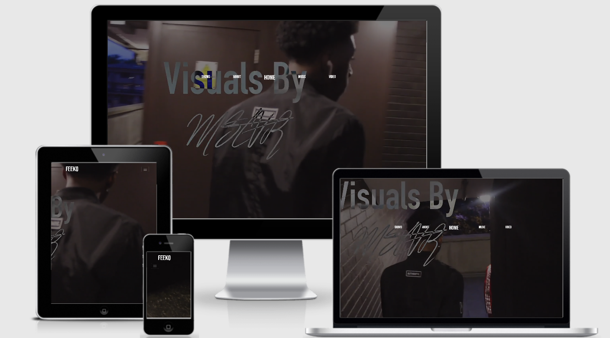

# FEEKO-msp2

## Project Purpose
A website that displays content and upcoming shows for an upcoming rapper to reach out to their audience. The website also allows users to view the locations of concerts with google maps api. It will increase the artist sales, streams and opportunity to get signed or have endorsements from companies.

## UX design

## User
The users of this site are current supporters, future supporters, and talent agencies or record labels.

### User stories
* A fan looking for more content from the artist
* A supporter trying to find pictures of the artist
* Endorsers or potential supporter trying to find the artist social media
* A supporter trying to find where to purchase tickets for performances
* Music labels scouting for talent.
* A supporter trying to find the artists music via spotify
* A supporter looking for videos of the artists 

## Design
The color scheme consists of pink, black and white for a clean and modern look, which corresponds well with the artist design for their new single.

### Mockups
The web page has mutiple pages with one page that opens directly to their spotify. This can be seen in the wireframe:

* [Wireframe](https://www.figma.com/file/5RMGbNNKPlEp4CalK8cPbX/Feeko--MS2?node-id=0%3A1)

## Features

### Planned features 

* Documentation - ReadMe File & Mockups
* Bootstrap
  * HTML
  * CSS 
  * JS
  * framework (grid system, buttons, modals, jumbotron, cards)- This makes the website more interactive and is easier for users to use. 
* Interactive google maps API
* GitHub -Remote Repository- Allows cohesive and easy collaborations, which helps to create a smooth and responsive website.
* GitHub pages - Deployed

### Future Features 
In the future, I would allow users to be able to listen to the artist music on the site while browsing. 

## Technologies used
* [HTML](https://developer.mozilla.org/en-US/docs/Web/HTML#:~:targetText=HTML%20(HyperText%20Markup%20Language)%20is,functionality%2Fbehavior%20(JavaScript).)
* [CSS](https://developer.mozilla.org/en-US/docs/Web/CSS#:~:targetText=Cascading%20Style%20Sheets%20(CSS)%20is,speech%2C%20or%20on%20other%20media.)
* [JS](https://www.javascript.com/)
* [Google chrome](https://www.google.com/chrome/)
* [Google](https://www.google.com/)
  * [Google Maps](https://www.javascript.com/)
    * [Google Maps API](https://developers.google.com/maps/documentation/javascript/tutorial?_ga=2.55997547.1334074779.1589732132-787921703.1589732054)
* [Bootstrap](https://getbootstrap.com/)
* [Visual Studio One](https://code.visualstudio.com/)
* [Github](https://github.com/)
* [Slack](https://slack.com/intl/en-gb/)
* [Youtube](https://www.youtube.com/)

## Testing

The website is easily accessible and allows supporters to find out more about the artist from the about page. The many pictures of the artist give those wanting to collaborate a good understanding of his image. The videos on youtube play while on the website when pressed and show the artist talents for supporters and possible talent recruiter. The social media icons help more supporters to connect with the artist. They highlight when they hovered on and go straight to these social media sites once clicked. All links on the site and the button for Spotify open in a new tab due to the 'target="blank"'.

I used different browsers to test this site, this included:
* Internet Explorer
* Google Chrome 
* Safari

Also, different devices were used, this includes :

* Samsung 8
* IPhone 6
* Macbook 
* Ipad mini
* Ipad pro
### Issues fixed

## Deployment
This website is hosted on [Github Pages](https://coexisting.github.io/Milestone-Project-1/) deployed using the master branch, explained [Here](https://help.github.com/en/github/getting-started-with-github/create-a-repo). The deployed site updates automatically upon new commits to the master branch. For the site to deploy correctly on GitHub pages, the landing page must be named index.html. This along with the Read.Me can be found in the root folder.

This can be run locally by cloning the repository https://github.com/Coexisting/Milestone-Project-1.git and pasting into your code IDE terminal. The website can be run by opening the HTML file within a web browser. The link provided can be visited and your website with any made changes will appear.

## Credit
### Media
All images were taken by and of the artist. All videos were obtained from [Youtube](https://www.youtube.com/) and are not owned by me.
### Content
All content was written by me for the artist.

### Acknowledgment
For all the help and inspiration:
* Code Institute
* [Slack](https://slack.com/intl/en-gb/) community
* [Stack overflow] (https://stackoverflow.com/) 
* Seun Owonikoko @seun_mentor
